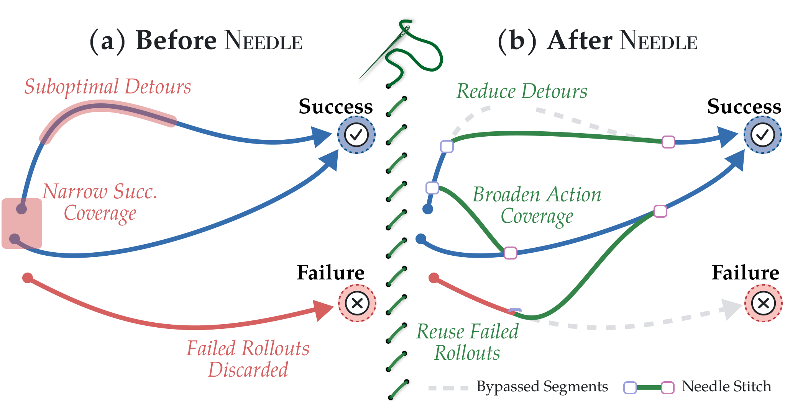

<h1 align="center">Needlework: Offline Rewriting of Robot Data with Verified Local Stitches</h1>

<p align="center">
  <a href="https://needle-work.github.io/"></a>
  
  
  <a href="LICENSE"></a>
</p>

<p align="center">
  
</p>

Offline trajectory stitching for visuomotor policies. A goal-conditioned inverse
dynamics model (IDM) proposes actions between logged observations. A verifier selects
reachable action prefixes, and a diffusion policy trains on the resulting bridges
alongside logged data. Stitching uses images and proprioception; it does not require
object state or a simulator. The code supports Robomimic (Can, Square, Transport)
and bimanual UMI.

## Contents

- [Installation](#installation-hammer_and_wrench)
- [Data](#data-card_file_box)
- [Quick start](#quick-start-rocket)
- [Outputs and resuming](#outputs-and-resuming-package)
- [Guides](#guides)
- [Acknowledgements](#acknowledgements-handshake)
- [License](#license-page_facing_up)


## Installation :hammer_and_wrench:

Request the gated DINOv3 ViT-B/16 weights from [Meta](https://ai.meta.com/dinov3/), then run from this checkout:

```bash
NEEDLEWORK_ROOT=/path/to/local/needlework ./install_deps.sh \
    --dinov3-weights /path/to/dinov3_vitb16_pretrain_lvd1689m-73cec8be.pth
```

In each shell session:

```bash
conda activate needlework
export NEEDLEWORK_ROOT=/path/to/local/needlework
source set_env.sh
```


## Data :card_file_box:

Place the needed archives in `NEEDLEWORK_ROOT/data/downloads/`:

```text
robomimic_{can,square,transport}_{success,failure}.zarr.zip
umi_{sweater,dish}_{success,failure}.zarr.zip
```

Verify and unpack individual tasks with:

```bash
python -m needlework.data.download robomimic/square
python -m needlework.data.download umi/sweater
```

Running the command without task arguments processes all tasks. The Robomimic
command also downloads the v1.5 low-dimensional HDF5 used for simulator resets.
The [store schema](src/needlework/data/schema.py) documents the Zarr arrays and
action conventions. Robomimic simulator state is never a model input or stitching
criterion.

## Quick start :rocket:

The commands below use Square as an example. Build frozen DINOv3 features first:

```bash
python -m needlework.build_features --domain robomimic --task square \
    --poolings spatial_softmax_14 patch_grid_7 --device cuda
```

Train a logged-data baseline, then the two stitching components:

```bash
python -m needlework.train component=policy task=robomimic/square run.name=square_baseline
python -m needlework.train component=idm task=robomimic/square run.name=square_idm
python -m needlework.train component=verifier task=robomimic/square run.name=square_verifier
```

Use the final IDM and verifier checkpoints to generate bridges, then train the
augmented policy:

```bash
python -m needlework.stitch task=robomimic/square run.name=square_bridges \
    idm_checkpoint=/path/to/square_idm/checkpoints/last.ckpt \
    verifier_checkpoint=/path/to/square_verifier/checkpoints/last.ckpt \
    'gpus=[0,1]'

python -m needlework.train component=policy task=robomimic/square run.name=square_augmented \
    sampler=augmented sampler.bridges=/path/to/square_bridges/bridges.zarr
```

Replace checkpoint and bridge paths with paths from your runs. `gpus` uses ordinals
within `CUDA_VISIBLE_DEVICES`. For UMI, build features with
`--domain umi --task sweater` and use `task=umi task.name=sweater` when training
and stitching.

Configuration is in [configs/](src/needlework/configs/); override values with
`key=value`. Each run records its configuration and checkpoints. W&B logging is
optional: run `wandb login` and pass `logging.wandb.enabled=true` to enable it.

## Outputs and resuming :package:

Runs are saved under `NEEDLEWORK_ROOT/outputs/<domain>/<task>/<component>/`.
Training writes `checkpoints/last.ckpt`; stitching writes `bridges.zarr`. To resume:

```bash
python -m needlework.train --resume /path/to/training/run
python -m needlework.stitch --resume /path/to/stitching/run 'gpus=[0,1]'
```

The [stitching guide](docs/pipeline.md) covers candidate selection,
thresholds, bridge storage, GPU workers, and resume behavior. See the
[bridge schema](src/needlework/data/bridges.py) for the output format.

## Guides

The [pipeline](docs/pipeline.md) and [training](docs/training.md) guides describe the
released workflow. For bridges generated with a new IDM or verifier, follow the
ordered [tuning guide](docs/tuning.md) to adapt bridge selection and policy sampling
to the new bridge set.

## Acknowledgements :handshake:

The UMI data collection workflow and related code draw on
[iPhUMI](https://github.com/real-stanford/iPhUMI). The diffusion U-Net builds on
[Diffusion Policy](https://github.com/real-stanford/diffusion_policy) and
[Diffuser](https://github.com/jannerm/diffuser).

## License :page_facing_up:

needlework is released under the [MIT License](LICENSE). See
[third-party notices](THIRD_PARTY_NOTICES.md) for adapted code. DINOv3 source and
weights are distributed separately under Meta's DINOv3 License. Dependencies and
datasets retain their own licenses.
